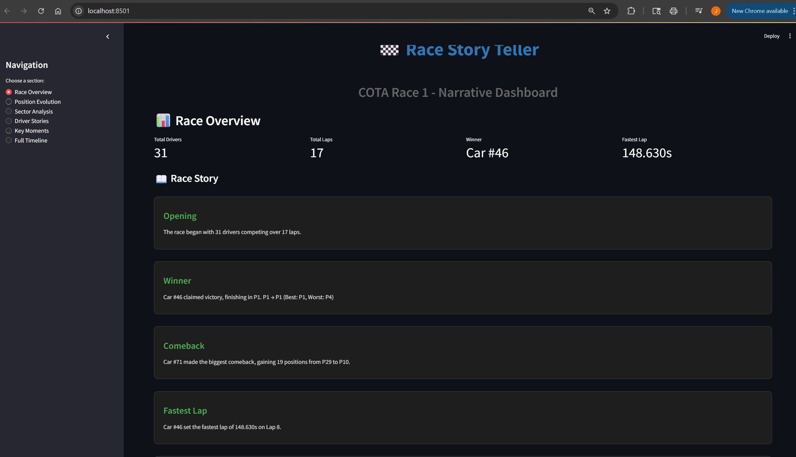
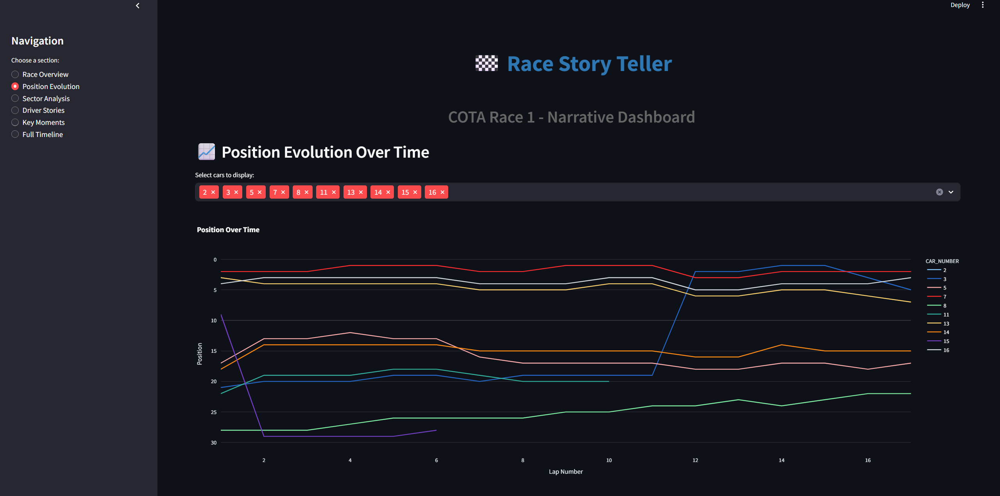
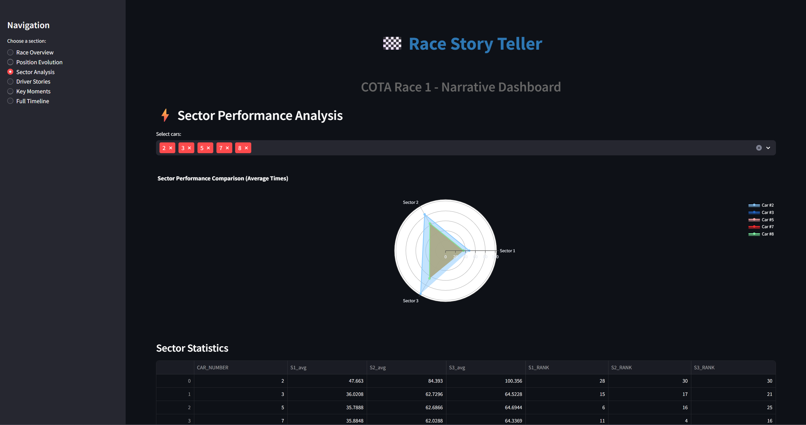
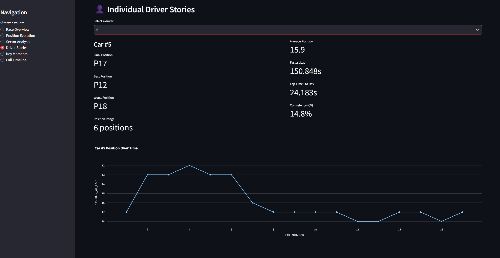
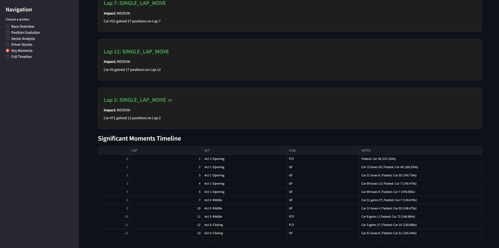

# 🏁 Race Story Teller - Interactive Racing Analytics Dashboard

> **A narrative data visualization platform that transforms raw racing telemetry into compelling race stories through interactive analytics and storytelling.**

[](https://www.python.org/)
[](https://streamlit.io/)
[](https://pandas.pydata.org/)
[](https://plotly.com/)

## 📊 Overview

**Race Story Teller** is an end-to-end data analytics and visualization project that analyzes professional racing data to extract insights, identify key moments, and present them through an interactive narrative dashboard. Built for the **Hack the Track - Toyota GR Cup** hackathon, this project demonstrates advanced data analysis, visualization, and storytelling capabilities.

### 🎯 Key Features

- **📈 Position Evolution Tracking**: Interactive line charts showing how each driver's position changed throughout the race
- **⚡ Sector Performance Analysis**: Radar charts and heatmaps comparing driver performance across track sectors
- **🎯 Key Moments Identification**: Automated detection of turning points, overtakes, flag periods, and strategic moments
- **👤 Individual Driver Stories**: Detailed narratives for each driver's race journey from start to finish
- **🌡️ Weather Impact Analysis**: Correlation analysis between weather conditions and lap performance
- **🚩 Flag Period Analysis**: Impact assessment of Full Course Yellow (FCY) periods and restarts
- **📖 Narrative Storytelling**: Automated generation of race story text from data insights
- **📅 Complete Race Timeline**: Lap-by-lap timeline with all significant events

## 🖼️ Dashboard Screenshots

### Race Overview

*Summary statistics, race story, and top finishers*

### Position Evolution

*Interactive position tracking over time with multi-driver selection*

### Sector Analysis

*Radar charts comparing sector performance across drivers*

### Driver Stories

*Individual driver narratives with detailed statistics*

### Key Moments

*Turning points and significant race events*

## 🛠️ Tech Stack

### Data Analysis
- **Pandas** - Data manipulation and analysis
- **NumPy** - Numerical computations
- **Jupyter Notebook** - Interactive analysis environment

### Visualization & Dashboard
- **Streamlit** - Interactive web dashboard framework
- **Plotly** - Interactive charts and graphs
- **Plotly Express** - High-level visualization API

### Data Processing
- **Custom time conversion utilities** - Handling MM:SS.mmm time formats
- **Data deduplication** - Handling duplicate lap records
- **Timezone conversion** - UTC/local time synchronization


## 🚀 Getting Started

### Prerequisites

- Python 3.8 or higher
- pip package manager

### Installation

1. **Clone the repository**
   ```bash
   git clone <your-repo-url>
   cd Toyota
   ```

2. **Install dependencies**
   ```bash
   pip install -r requirements_dashboard.txt
   ```

3. **Run the analysis notebook**
   - Open `COTA_Race_Story_Analysis.ipynb` in Jupyter
   - Execute all cells to generate analysis and insights
   - Run the export cell (Cell 106) to create dashboard data files

**Launch the dashboard**
   ```bash
   streamlit run race_story_dashboard.py
   ```
   The dashboard will open at `http://localhost:8501`

## 📊 Analysis Phases

The project follows a comprehensive 10-phase analysis approach:

1. **Data Preparation** - Cleaning, parsing, and structuring race data
2. **Basic Race Overview** - Summary statistics and race fundamentals
3. **Position Over Time** - Tracking position changes and overtakes
4. **Sector Performance** - Analyzing S1, S2, S3 sector times
5. **Weather Impact** - Correlating weather conditions with performance
6. **Flag Impact Analysis** - Assessing FCY/GF/FF flag period effects
7. **Lap Consistency & Degradation** - Tire wear and performance trends
8. **Strategic Moments** - Identifying key decision points
9. **Narrative Elements** - Extracting race acts and turning points
10. **Dashboard-Ready Data** - Preparing structured data for visualization

## 🎓 Key Learnings & Challenges

### Technical Challenges Solved

- **Duplicate Lap Records**: Implemented deduplication logic to handle multiple lap entries per car
- **Timezone Synchronization**: Resolved UTC/local time mismatch between lap and weather data
- **Data Quality Issues**: Built robust error handling for missing/invalid time formats
- **Complex Position Calculations**: Developed cumulative time-based position tracking algorithm
- **Interactive Visualizations**: Created responsive charts with multi-driver selection


## 📈 Project Impact

This project demonstrates the ability to:
- Transform raw data into actionable insights
- Build production-ready interactive dashboards
- Tell compelling stories through data visualization
- Handle complex real-world data challenges
- Complete an end-to-end data science project


